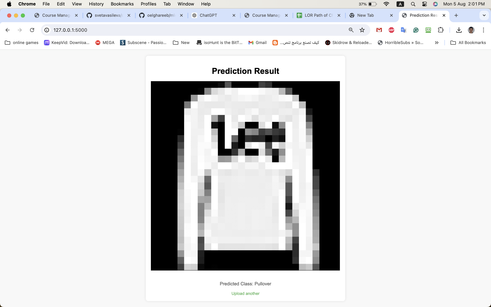
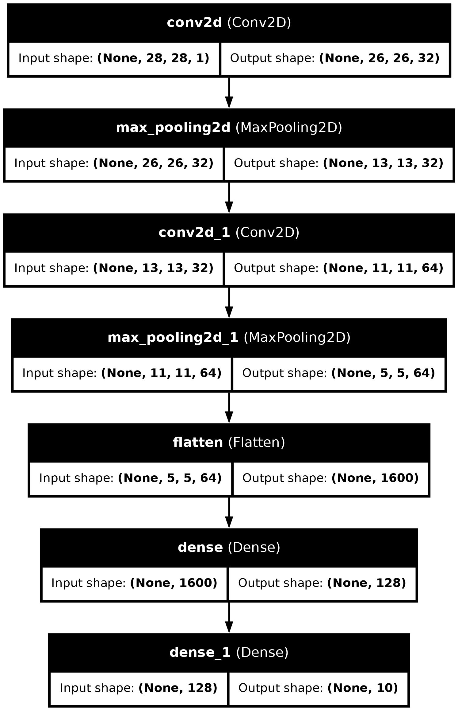

# Fashion MNIST Image Classifier



## Problem Statement
This project aims to develop a Flask-based web application for classifying fashion items into specific categories using a convolutional neural network (CNN) model. The project will also focus on employing MLOps techniques to ensure the application is robust and maintainable. This includes continuous integration, continuous deployment (CI/CD), automated testing, and containerization.

Here is the list of classes:


## Objective
The primary objective of this project is to create a web application that allows users to upload images of fashion items and receive classification predictions. The project will cover the following key areas:
- **Image Upload Functionality**: Implement a web interface where users can upload images of fashion items.
- **Model Integration**: Integrate a trained CNN model for fashion item classification.
- **Image Storage**: Ensure images are stored on the server.
- **Prediction Retrieval**: Provide a mechanism for users to view classification predictions.
- **Code Quality**: Utilize linting tools (e.g., flake8) to maintain high code quality.
- **Automated Testing**: Implement unit and integration tests using pytest to ensure the application works as expected.
- **Continuous Integration**: Set up GitHub Actions to automate testing and linting on each commit.
- **Infrastructure as Code**: Use Terraform to create and manage infrastructure.
- **Containerization**: Use Docker to containerize the application for consistent deployment across different environments.
- **Makefile Automation**: Create a Makefile to automate common tasks like building and running the Docker container, running tests, and linting.

## CNN Architecture
The CNN model used in this project is defined as follows:


```python
model = Sequential([
    Conv2D(32, (3, 3), activation='relu', input_shape=(28, 28, 1)),
    MaxPooling2D((2, 2)),

    Conv2D(64, (3, 3), activation='relu'),
    MaxPooling2D((2, 2)),

    Flatten(),
    Dense(128, activation='relu'),
    Dense(10, activation='softmax')
])
```

## Infrastructure Setup

### Generate EC2 Instance SSH Key
```bash
cd terraform && ssh-keygen -f fashion_mnist_key
```

### Setup AWS
- Adjust Terraform S3 backend name in the `providers.tf`.
- Run `aws configure` and provide your Access Keys.
- Adjust VPC ID in the `main.auto.tfvars`.
- `terraform init`
- `terraform plan`
- `terraform apply`

### Configure Docker on the EC2
Substitute `<EC2_DNS_INSTANCE_HOSTNAME>` with the EC2 instance DNS address.
```bash
ssh -i "fashion_mnist_key" ec2-user@<EC2_DNS_INSTANCE_HOSTNAME>
sudo yum install docker-ce docker-ce-cli containerd.io docker-buildx-plugin docker-compose-plugin
```

## Model Training
The model `fashion_mnist_model.h5` is committed to the repository. To train it from scratch:
- Ensure an MLFLOW instance is running and configure AWS credentials in the `.env` file.
```bash
make train-model
```
Git LFS is required to commit the model to GitHub as it's more than 200MB.
```bash
git lfs install
git lfs track "*.h5"
git add .gitattributes
git add model/fashion_mnist_model.h5
```

## Web Application Deployment
The web application is deployed with GitHub Actions automatically to the EC2 instance. The GHA workflow requires the following secrets to be set up for successful deployment:
```plaintext
AWS_ACCESS_KEY_ID
AWS_SECRET_ACCESS_KEY
EC2_SSH_KEY
EC2_USER
EC2_HOST
```
The application should start listening at [http://<EC2_DNS_NAME>:80](http://<EC2_DNS_NAME>:80).

## Setup Instructions

1. Clone the repository:
```bash
git clone https://github.com/yourusername/fashion-mnist-classifier.git
cd fashion-mnist-classifier
```

2. Install dependencies:
```bash
pip install -r requirements.txt
```

3. Download the data:
```bash
python download_data.py
```

4. Train the model:
```bash
python scripts/train.py
```

5. Run the web application:
```bash
python src/main.py
```
